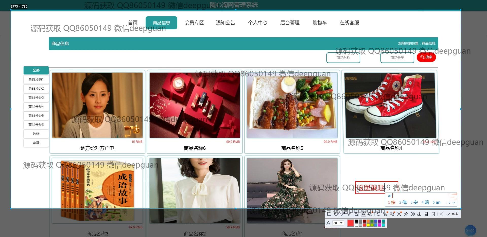
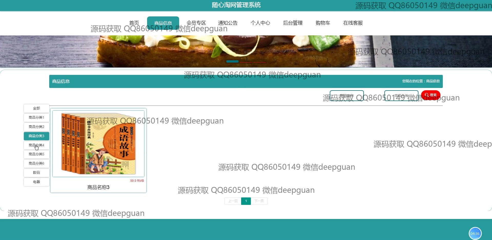
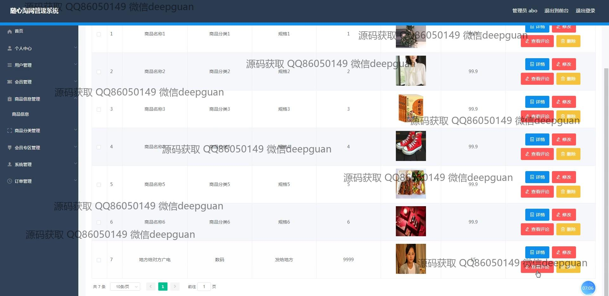
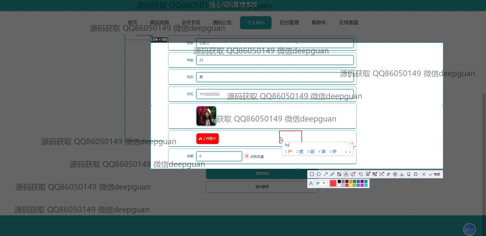

<h1 align="center">基于SSM+Vue的随心淘网管理系统+vue</h1>

## 简介
随心淘网管理系统：角色分为管理员、用户；商品管理、用户管理、订单管理、会员专区、系统管理等功能，界面简洁，操作直观，提升运营效率。    --计算机毕业设计源码；毕设源码；java毕业设计源码

## 联系方式

<h3 align="center">获取完整代码与数据库文件 + 微信：deepguan QQ: 86050149 QQ群: 783742310</h3>

<h3 align="center">可帮忙远程部署 包运行成功！提供远程部署、修改代码、设计文档指导、代码讲解等服务！</h3>

## 功能介绍（完整见运行截图）
管理员：基本功能包括登录、注册、退出，拥有网站首页的导航栏和欢迎信息。主要管理功能涵盖用户管理、商品信息管理、订单管理、商品分类管理、会员专区管理和系统管理。在商品管理上，可以进行商品的添加、修改、删除，并查看订单详情。通过系统可以上传商品图片、设置价格、输入商品介绍和更新个人信息。同时，还提供了个人中心功能，查看并修改个人信息、审核用户信息、查看并管理用户订单和评论。支持数据统计与分析以及商品推荐功能，以帮助优化网站运营。

用户：基本功能包含登录和注册，提供导航栏以便浏览商品和管理个人信息。在商品模块，用户可查看商品详情、进行商品搜索、添加商品到购物车及完成在线付款。个人中心使用户能够查看和修改个人资料、查询订单、管理地址簿和收藏夹。此外，界面支持商品分页浏览和按类别筛选商品，并附有商品评价区以供用户提交反馈。用户还可以使用模块化功能如会员专区、公告查看、在线客服和购物车访问等以提高购物体验。页面设计简洁直观，注重用户体验与便捷操作。

## 运行截图

本代码来源于网络,仅供学习参考使用!

